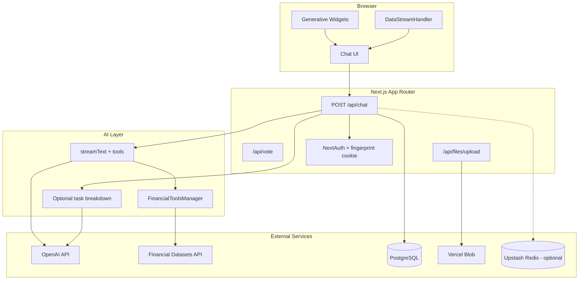

# Architecture

This document describes how the AI Financial Agent is structured, how data flows through the system, and where to extend it.

## Overview

The app is a **Next.js 15** (stable) chat application that streams OpenAI responses, calls financial data tools, and renders results as generative UI widgets inside the conversation. It is designed as an educational demo, not a production trading platform.

## Directory layout

| Path | Purpose |
|------|---------|
| `app/(chat)/` | Chat pages and API routes (`/api/chat`, `/api/vote`, `/api/history`) |
| `app/(auth)/` | NextAuth config, anonymous session bootstrap |
| `components/` | Chat UI, financial widgets, shadcn primitives |
| `lib/ai/` | Models, prompts, task breakdown, tool definitions |
| `lib/ai/tools/` | `FinancialToolsManager` and Financial Datasets API client |
| `lib/db/` | Drizzle schema, queries, migrations |
| `lib/server/` | Rate limiting, API key resolution, upload path helpers |
| `lib/api/` | Zod request validation |
| `hooks/` | Client loading state scoped per chat |

## Authentication

The demo uses **anonymous fingerprint auth**, not email/password.

1. A `fingerprint` cookie is set on first visit.
2. `AuthCheck` in the root layout calls `ensureSession()` when unauthenticated.
3. NextAuth creates or restores a user like `user-{fingerprint}@auto.generated`.
4. Chat history is tied to that user in PostgreSQL.

`AUTH_SECRET` is required for session signing. See [README](../README.md#authentication).

## Chat request flow

1. **Client** sends `POST /api/chat` with `id`, `messages`, `modelId`, and optional BYOK keys.
2. **Validation** — `chatRequestSchema` (Zod) validates the payload.
3. **Auth & rate limit** — session required; `checkRateLimit` uses Upstash when configured, otherwise in-memory.
4. **API keys** — server env keys take precedence over client keys unless `NEXT_PUBLIC_ALLOW_CLIENT_API_KEYS=true`.
5. **Optional task breakdown** — when `ENABLE_TASK_BREAKDOWN=true`, an extra `generateObject` call produces research step labels for the UI.
6. **Streaming** — `streamText` runs with `FinancialToolsManager` tools and merges into a data stream.
7. **Persistence** — user and assistant messages saved to PostgreSQL; tool results render as widgets on the client.

### Vision / image inputs

Users can attach JPEG or PNG images via the paperclip control. Images are uploaded to Vercel Blob, then sent to the model as multimodal content (`text` + `image` parts). All configured models support vision. Attachments are stored in message `content` JSON and restored when chats are reloaded.

## Financial tools

`FinancialToolsManager` exposes eight tools backed by the [Financial Datasets API](https://financialdatasets.ai):

- Stock prices, fundamentals (income, balance sheet, cash flow, metrics)
- Stock screener, comparison, news

Each tool:

- Validates inputs with Zod
- Caches responses for 10 minutes (`unstable_cache`)
- Emits `tool-loading` events for the UI
- Returns structured data mapped to React widgets in `components/message.tsx`

## Data model

| Table | Role |
|-------|------|
| `User` | Anonymous demo users |
| `Chat` | Conversation metadata, public/private visibility |
| `Message` | JSON `content` (text, tool calls, image parts) |
| `Vote` | Per-message up/down votes |

Drizzle migrations live in `lib/db/migrations/`. Run `pnpm db:migrate` after schema changes.

## API routes

| Route | Method | Description |
|-------|--------|-------------|
| `/api/chat` | POST, DELETE | Stream chat / delete chat |
| `/api/history` | GET | Sidebar chat list |
| `/api/vote` | GET, PATCH | Read and record votes |
| `/api/files/upload` | POST | Image upload to Vercel Blob |
| `/api/validate-api-key` | POST | Server-side OpenAI key check |
| `/api/auth/[...nextauth]` | * | NextAuth handlers |

## Configuration

| Variable | Purpose |
|----------|---------|
| `OPENAI_API_KEY` | LLM provider |
| `FINANCIAL_DATASETS_API_KEY` | Market data |
| `AUTH_SECRET` | Session signing |
| `POSTGRES_URL` | Database |
| `BLOB_READ_WRITE_TOKEN` | Image uploads |
| `UPSTASH_REDIS_REST_URL` / `TOKEN` | Distributed rate limits (optional) |
| `ENABLE_TASK_BREAKDOWN` | Extra LLM call for research steps (optional) |
| `NEXT_PUBLIC_ALLOW_CLIENT_API_KEYS` | BYOK in browser (demo/dev only) |

## Testing

| Command | Scope |
|---------|-------|
| `pnpm test` | Vitest unit and API route tests |
| `pnpm typecheck` | TypeScript |
| `pnpm test:e2e` | Playwright smoke test |

## Extension points

- **New tools** — add methods in `lib/ai/tools/financial-tools.ts` and widget mapping in `components/message.tsx`
- **New models** — update `lib/ai/models.ts` and validation `modelIds`
- **Auth** — replace fingerprint flow in `app/(auth)/auth.ts` for real credentials
- **Data provider** — swap `lib/ai/tools/financial-api.ts` for another market data source
